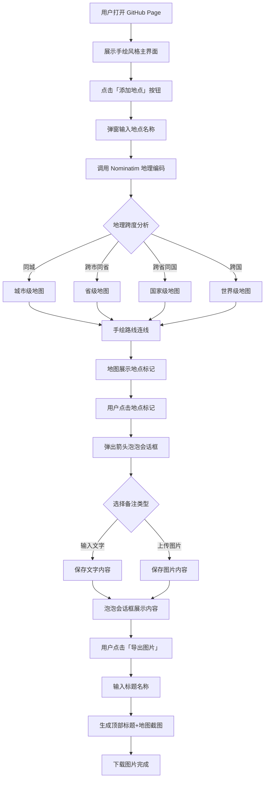

# 手绘风格地图路线生成器 PRD

## 1. 产品概述

一款部署在 GitHub Pages 上的手绘风格旅行路线地图生成器。用户输入一系列地点，应用自动识别地理跨度（同城/跨市/跨省/跨国）并匹配相应层级的地图，以手绘墨迹风格绘制路线连线；每个地点可添加文字或图片备注，以箭头泡泡会话框形式呈现；最终可输入标题导出为一张旅行手账风格的图片。

- **核心目标**：让旅行记录像在素描本上随手画下的旅行手账，兼具地理准确性与手绘艺术感
- **目标用户**：旅行爱好者、旅行博主、手账爱好者、希望用独特视觉方式记录行程的人群
- **核心价值**：零安装、零注册、打开即用、一键导出精美手绘旅行地图

## 2. 核心功能

### 2.2 功能模块

1. **地图绘制主页**：地点输入、地图自适应展示、手绘路线连线、地点泡泡会话框、导出功能

### 2.3 页面详情

| 页面名称 | 模块名称 | 功能描述 |
|-----------|-------------|---------------------|
| 地图绘制主页 | 地点输入面板 | 弹窗式输入框，支持逐个添加地点名称，展示已添加地点列表，支持删除与排序 |
| 地图绘制主页 | 自适应地图层 | 根据地点地理跨度自动切换地图层级：同城→城市级、跨市→省级、跨省→国家级、跨国→世界级 |
| 地图绘制主页 | 手绘路线绘制 | 在地图上以手绘墨迹风格连接各地点，带方向箭头，支持曲线抖动效果 |
| 地图绘制主页 | 地点标记与泡泡 | 每个地点用手绘图钉标记，点击弹出箭头泡泡会话框，可输入文字或上传图片 |
| 地图绘制主页 | 导出图片模块 | 输入标题名称，导出图片顶部居中显示标题，下方为地图及手绘路线的完整截图 |

## 3. 核心流程

### 3.1 用户主流程

用户打开页面 → 看到手绘风格的欢迎界面与"添加地点"入口 → 点击后弹窗输入地点名称（支持多个） → 系统自动地理编码并分析地理跨度 → 自适应调整地图层级与视野 → 手绘风格路线依次连接各地点 → 用户点击任意地点标记 → 弹出箭头泡泡会话框 → 输入文字或上传图片 → 点击"导出图片"按钮 → 输入标题 → 生成并下载图片

### 3.2 流程图

## 4. 用户界面设计

### 4.1 设计风格

**核心美学方向：旅行手账 / 素描本风格**

- **主色调**：仿古纸张米色 `#F4E8D0` 为背景，墨水深棕 `#3E2C1C` 为主线条色，旅行印章红 `#C73E1D` 为强调色，水彩蓝绿 `#5B8E7D` 为辅助色
- **按钮风格**：手绘边框按钮，不规则圆角，hover 时有轻微抖动效果模拟手写笔触
- **字体**：标题使用「马善政体 Ma Shan Zheng」（中文手写）与「Caveat」（英文手写）混排，正文使用「Noto Serif SC」
- **布局风格**：全屏地图为主视觉，左侧悬浮手账风控制面板，右上角导出按钮，整体如摊开的旅行手账
- **图标/emoji 风格**：手绘 SVG 图标（图钉、指南针、邮票、印章），避免使用扁平化通用图标
- **纹理细节**：纸张噪点纹理叠加、墨水晕染效果、手绘装饰边框、胶带贴片元素

### 4.2 页面设计概览

| 页面名称 | 模块名称 | UI 元素 |
|-----------|-------------|-------------|
| 地图绘制主页 | 背景层 | 仿古纸张纹理、墨水渍装饰、四角手绘装饰花纹 |
| 地图绘制主页 | 左侧控制面板 | 半透明米色纸张质感面板，手绘边框，顶部标题"旅行手账"，地点输入区，已添加地点列表（手写编号） |
| 地图绘制主页 | 地图区域 | 居中全屏地图，CSS 滤镜营造水彩质感，手绘风格缩放控件 |
| 地图绘制主页 | 地点标记 | 手绘图钉 SVG，编号手写体，hover 抖动 |
| 地图绘制主页 | 泡泡会话框 | 手绘不规则圆角矩形，带箭头指向地点，内含文字或图片，手写体排版 |
| 地图绘制主页 | 右上角导出按钮 | 印章风格圆形按钮，"导出"字样，hover 旋转盖章效果 |
| 地图绘制主页 | 导出弹窗 | 信封风格弹窗，标题输入框（手写体），预览缩略图，下载按钮 |

### 4.3 响应式设计

- **桌面优先**：宽屏下左侧面板 + 全屏地图布局，充分发挥手账摊开的视觉感
- **平板适配**：面板转为顶部折叠式，地图占据下方区域
- **移动端适配**：面板变为底部抽屉，地图全屏，泡泡会话框全屏展开，触摸优化（地点标记点击区域放大）

## 5. 功能细节说明

### 5.1 地理跨度自动识别逻辑

- 通过 Nominatim 地理编码返回的 `address` 字段判断每个地点的行政层级
- 比较所有地点的 `city`/`state`/`country` 字段：
  - 所有地点 `city` 相同 → 城市级（zoom 11-13）
  - `city` 不同但 `state` 相同 → 省级（zoom 7-8）
  - `state` 不同但 `country` 相同 → 国家级（zoom 4-5）
  - `country` 不同 → 世界级（zoom 2-3）
- 使用 `fitBounds` 自动适配所有地点的视野范围

### 5.2 手绘路线绘制

- 使用 rough.js 生成手绘风格 SVG 路径
- 路线为连接相邻地点的曲线（贝塞尔曲线加随机抖动）
- 每段路线末端带手绘箭头标识方向
- 路线颜色为墨水深棕，带轻微透明度模拟墨迹浓淡

### 5.3 地点泡泡会话框

- 点击地点标记后在标记旁弹出泡泡会话框
- 泡泡为手绘不规则圆角矩形，底部有箭头指向地点
- 支持两种内容类型：纯文字（手写体展示）、图片（上传后裁剪为圆角展示）
- 多个地点的泡泡可同时展开，支持拖拽调整位置避免重叠
- 点击泡泡外区域或关闭按钮收起

### 5.4 导出图片规格

- 导出尺寸：1920×1280（3:2 比例，适合分享）
- 顶部 15% 区域：仿古纸张背景，标题居中，手写体大字，两侧手绘装饰
- 下方 85% 区域：地图截图含手绘路线与所有展开的泡泡会话框
- 导出格式：PNG
- 使用 html2canvas 捕获地图区域并合成最终图片
