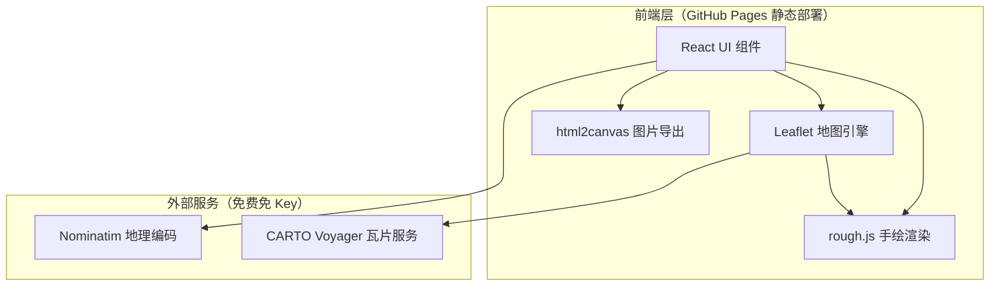
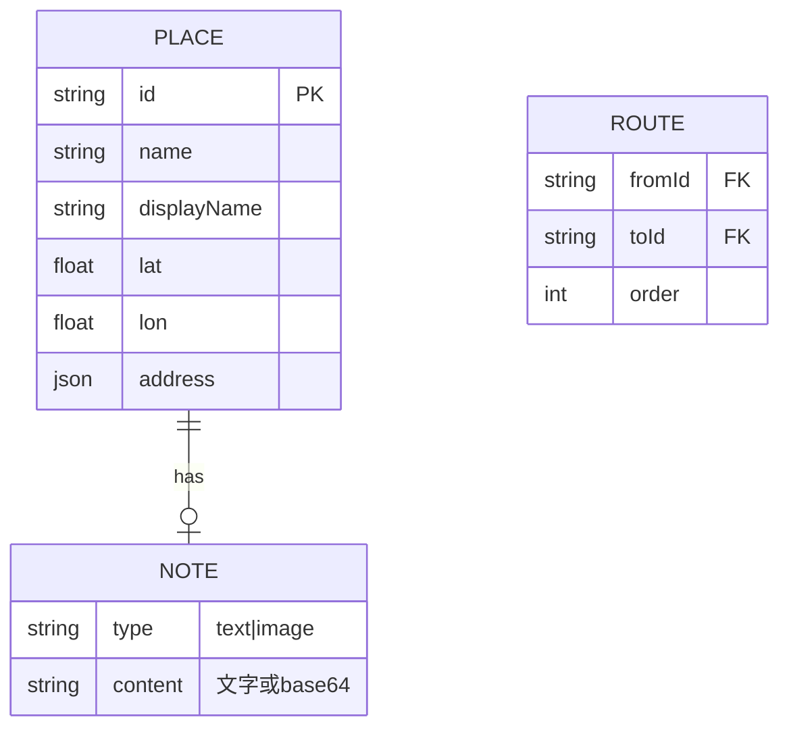

# 手绘风格地图路线生成器 技术架构文档

## 1. 架构设计



**架构说明**：纯前端静态应用，无后端。React 负责 UI 状态管理，Leaflet 负责地图渲染与交互，rough.js 负责手绘风格路线与图形渲染，html2canvas 负责最终图片导出。地理编码使用 OpenStreetMap 的 Nominatim 服务（免费、无需 API Key、有速率限制 1 次/秒），地图瓦片使用 CARTO Voyager 免费服务。

## 2. 技术说明

- **前端框架**：React@18 + Vite@5
- **样式方案**：TailwindCSS@3 + 自定义 CSS（手绘风格无法完全用原子类实现）
- **地图引擎**：Leaflet@1.9 + react-leaflet@4
- **手绘渲染**：rough.js@4（生成手绘风格 SVG）
- **图片导出**：html2canvas@1.4
- **地理编码**：Nominatim OpenStreetMap API（`https://nominatim.openstreetmap.org/search`）
- **地图瓦片**：CARTO Voyager（`https://{s}.basemaps.cartocdn.com/rastertiles/voyager/{z}/{x}/{y}{r}.png`）
- **初始化工具**：vite-init（`npm create vite@latest`）
- **后端**：无（纯静态部署）
- **数据库**：无（所有数据存于内存，不持久化）

## 3. 路由定义

| 路由 | 用途 |
|-------|---------|
| `/` | 地图绘制主页（唯一页面，所有功能集中于此） |

部署到 GitHub Pages 时需配置 Vite 的 `base` 路径为仓库名（如 `/hand_drawn_map/`）。

## 4. 关键模块设计

### 4.1 地理编码与层级识别模块

```typescript
// 地点数据结构
interface PlaceLocation {
  id: string;
  name: string;           // 用户输入的原始名称
  displayName: string;    // Nominatim 返回的完整名称
  lat: number;
  lon: number;
  address: {
    city?: string;
    state?: string;
    country?: string;
    country_code?: string;
  };
  note?: {
    type: 'text' | 'image';
    content: string;      // 文字内容或图片 base64
  };
}

// 地理层级枚举
type MapLevel = 'city' | 'province' | 'country' | 'world';

// 根据地点列表判断地图层级
function detectMapLevel(places: PlaceLocation[]): MapLevel
```

**识别逻辑**：
1. 提取所有地点的 `country` 字段，若存在不同 → `world`
2. 否则提取 `state` 字段，若存在不同 → `country`
3. 否则提取 `city` 字段，若存在不同 → `province`
4. 否则 → `city`

**Nominatim 调用约束**：
- 请求头需设置 `User-Agent`（浏览器端通过 `Referer` 识别）
- 请求频率限制：≤1 次/秒，需在前端做请求队列节流
- 参数：`format=jsonv2`、`addressdetails=1`、`limit=1`、`accept-language=zh-CN`

### 4.2 手绘路线渲染模块

```typescript
// 使用 rough.js 在 SVG overlay 上绘制
// 核心思路：
// 1. 将地理坐标通过 Leaflet 的 latLngToContainerPoint 转为像素坐标
// 2. 相邻地点间用贝塞尔曲线生成控制点
// 3. 用 rough.js 的 curve/path 绘制手绘风格线条
// 4. 在终点绘制手绘箭头

interface RouteSegment {
  from: { x: number; y: number };
  to: { x: number; y: number };
  controlPoint: { x: number; y: number };  // 贝塞尔控制点
}
```

**渲染流程**：
- 监听 Leaflet 的 `moveend`/`zoomend` 事件，重新计算像素坐标并重绘路线
- rough.js 配置：`roughness: 1.5`、`bowing: 2`、`strokeWidth: 2.5`、`stroke: '#3E2C1C'`
- 箭头通过 rough.js 的 `polygon` 绘制三角形并旋转至路线方向

### 4.3 泡泡会话框模块

```typescript
interface BubbleState {
  placeId: string;
  isOpen: boolean;
  position: { x: number; y: number };  // 像素坐标，可拖拽
  editing: boolean;                     // 是否处于编辑态
}
```

**实现方式**：
- 泡泡为绝对定位的 DOM 元素，浮在地图 overlay 层上
- 使用 SVG 绘制手绘不规则圆角矩形边框（rough.js）
- 箭头为 SVG path，从泡泡底部指向地点标记
- 图片上传通过 `FileReader.readAsDataURL` 转 base64 存储在内存
- 拖拽通过监听 `mousedown`/`mousemove`/`mouseup` 实现

### 4.4 导出图片模块

```typescript
// 导出流程
async function exportImage(title: string): Promise<void> {
  // 1. 临时展开所有泡泡会话框
  // 2. 使用 html2canvas 捕获地图容器
  // 3. 创建新 canvas，尺寸 1920×1280
  // 4. 上方 15% 绘制标题区（纸张背景 + 手写标题 + 装饰）
  // 5. 下方 85% 绘制地图截图
  // 6. canvas.toBlob → 触发下载
}
```

**注意事项**：
- html2canvas 需处理跨域瓦片：CARTO 瓦片支持 CORS，需设置 `useCORS: true`
- 导出前需等待所有瓦片加载完成（监听 Leaflet `load` 事件）
- 标题区使用 Canvas API 绘制手写体文字（加载 Web Font 后绘制）

## 5. 数据模型

### 5.1 内存数据结构



所有数据仅存于 React state 中，不做持久化。页面刷新即清空。

## 6. 部署配置

### 6.1 Vite 配置

```javascript
// vite.config.js
export default defineConfig({
  base: '/hand_drawn_map/',  // GitHub Pages 仓库名
  plugins: [react()],
})
```

### 6.2 GitHub Pages 部署

- 构建命令：`npm run build`
- 输出目录：`dist`
- 通过 GitHub Actions 自动部署到 Pages，或手动将 `dist` 内容推送到 `gh-pages` 分支

## 7. 性能与限制说明

- **Nominatim 速率限制**：1 次/秒，多地点输入时需队列节流，避免被封禁
- **瓦片加载**：跨层级时瓦片加载需 1-3 秒，需展示 loading 状态
- **html2canvas 限制**：对 CSS 滤镜支持有限，水彩质感效果在导出图片中可能减弱，需通过其他方式补偿
- **内存占用**：图片 base64 存于内存，大量上传可能导致内存增长，建议限制单图大小 ≤2MB
